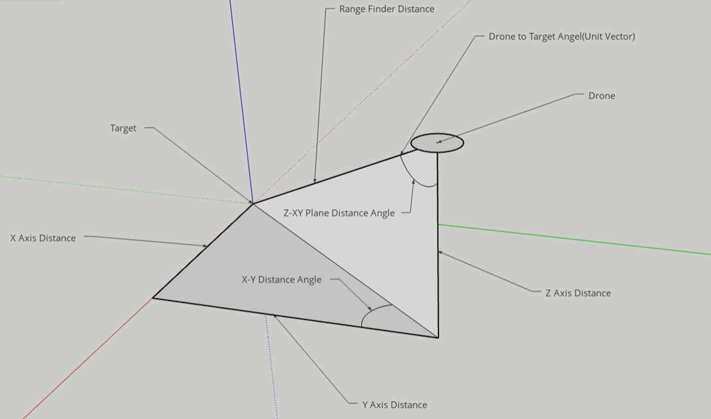
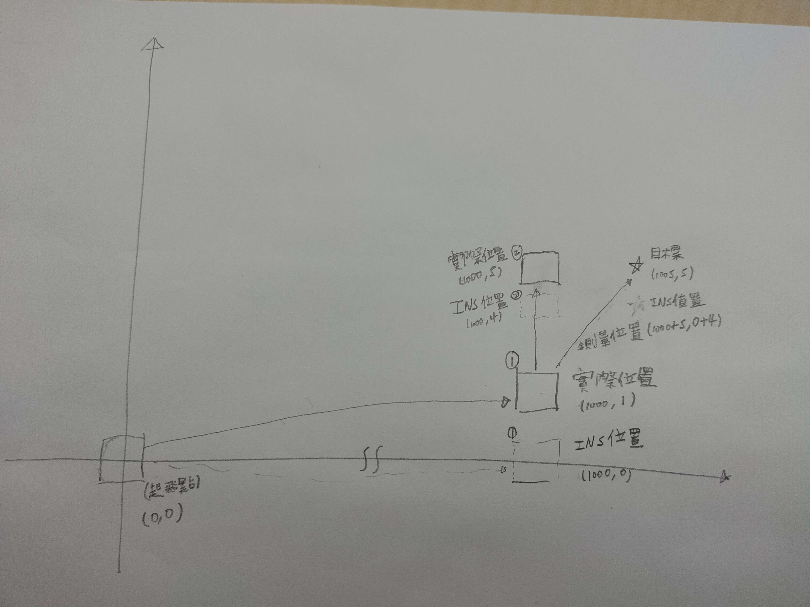
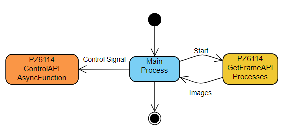
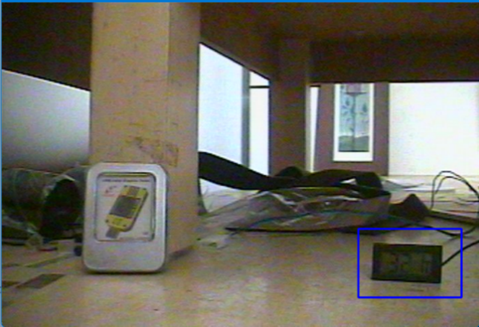
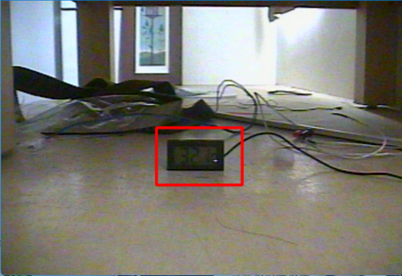
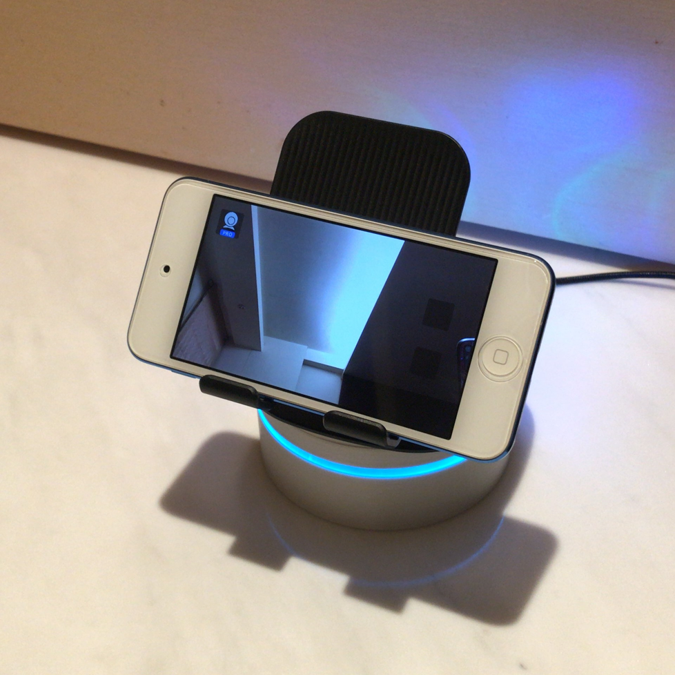

# ModernSolutionPlatform-P
 Public repo of MSP 
 The PTZ are designed to be installed on ANY kind of vehicles including jets.
 
## RuleBased

Demo:

## OpenCVBased

Demo:

## GoogleMediapipeBased
Demo:

