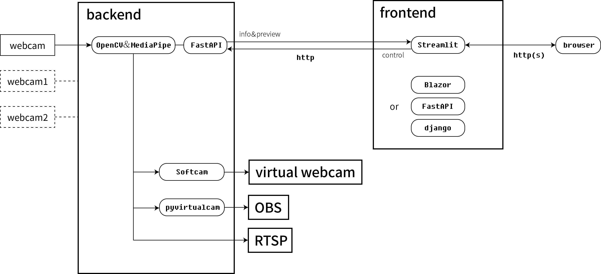
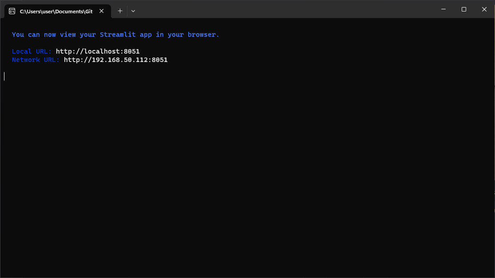
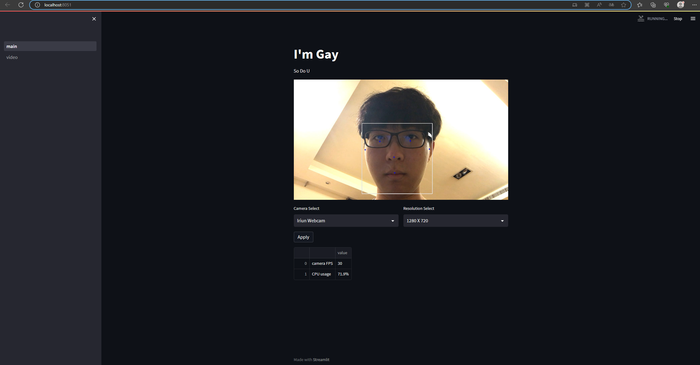

# webcam_tracker
一個比帶延遲三秒的IP cam上飛機有用的東西
 
***
## 目前架構
  

***
## 運行預覽：
  
  

***
## 編譯後執行狀況：
前端：尚無法正常運行  
後端：可正常運行，但程式啟動時，電腦的音訊服務會暫時失效

***
## 已知問題：
在前端切換幾次相機解析度會造成解析度顯示錯誤，但不影響功能，已確認是快取問題  
同時開兩個以上的前端頁面控制會造成錯誤  
抓OBS虛擬攝影機畫面將直接當掉

***
## 使用的非標準庫： 
 - fastapi 
 - mediapipe
 - numpy
 - opencv
 - pandas
 - pygrabber
 - requests
 - streamlit
 - uvicorn